# Laporan Tugas Praktikum Basis Data - Database Akademik

Proyek ini berisi implementasi eksekusi kueri DDL (*Data Definition Language*) dan DML (*Data Manipulation Language*) pada database **`akademik`** menggunakan phpMyAdmin (MySQL/MariaDB). Dokumen ini mencakup pembuatan struktur tabel dasar, penerapan integritas referensial, modifikasi skema tabel, penjelasan kode penting, penandaan screenshot, dan penanganan error[cite: 10, 11].

---

## 1. Eksekusi Program Pertemuan 3

Proyek dijalankan pada database `akademik` yang mencakup 5 tabel utama: `mahasiswa`, `dosen`, `mata_kuliah`, `krs`, dan `nilai`. Semua kueri berhasil dieksekusi tanpa error kritis[cite: 10, 11].

### A. Pembuatan Database & Tabel Utama (`mahasiswa`, `dosen`, `mata_kuliah`)
```sql
CREATE DATABASE IF NOT EXISTS akademik
CHARACTER SET utf8mb4 COLLATE utf8mb4_unicode_ci;
USE akademik;

CREATE TABLE IF NOT EXISTS mahasiswa (
    nim VARCHAR(15) PRIMARY KEY,
    nama VARCHAR(100) NOT NULL,
    email VARCHAR(120) NOT NULL UNIQUE,
    prodi VARCHAR(80) NOT NULL,
    angkatan YEAR NOT NULL,
    ipk DECIMAL(3,2) DEFAULT 0.00,
    CONSTRAINT chk_ipk CHECK (ipk BETWEEN 0.00 AND 4.00)
) ENGINE=InnoDB;

CREATE TABLE IF NOT EXISTS dosen (
    nidn VARCHAR(20) PRIMARY KEY,
    nama VARCHAR(100) NOT NULL,
    email VARCHAR(120) UNIQUE
) ENGINE=InnoDB;

CREATE TABLE IF NOT EXISTS mata_kuliah (
    kode_mk VARCHAR(12) PRIMARY KEY,
    nama_mk VARCHAR(100) NOT NULL,
    sks TINYINT UNSIGNED NOT NULL,
    nidn VARCHAR(20),
    CONSTRAINT fk_mk_dosen FOREIGN KEY (nidn) 
        REFERENCES dosen(nidn) 
        ON UPDATE CASCADE ON DELETE SET NULL
) ENGINE=InnoDB;
CREATE TABLE IF NOT EXISTS krs (
    id BIGINT UNSIGNED AUTO_INCREMENT PRIMARY KEY,
    nim VARCHAR(15) NOT NULL,
    kode_mk VARCHAR(12) NOT NULL,
    semester TINYINT UNSIGNED NOT NULL,
    tahun_ajaran VARCHAR(9) NOT NULL,
    nilai_huruf CHAR(2) NULL,
    CONSTRAINT uq_krs UNIQUE (nim, kode_mk, semester, tahun_ajaran),
    CONSTRAINT fk_krs_mahasiswa FOREIGN KEY (nim) 
        REFERENCES mahasiswa(nim) 
        ON UPDATE CASCADE ON DELETE CASCADE,
    CONSTRAINT fk_krs_mk FOREIGN KEY (kode_mk) 
        REFERENCES mata_kuliah(kode_mk) 
        ON UPDATE CASCADE ON DELETE RESTRICT
) ENGINE=InnoDB;

2. Modifikasi Program (Dua Modifikasi Bermakna)
Modifikasi 1: Penambahan Field & Validasi pada Tabel mahasiswa dan mata_kuliah
-- Penambahan Kolom Email
ALTER TABLE mahasiswa 
ADD COLUMN email VARCHAR(120) AFTER nama;

-- Penambahan Constraint Validasi Email & Angkatan
ALTER TABLE mahasiswa 
ADD CONSTRAINT chk_email_mahasiswa CHECK (email LIKE '%@%.%'),
ADD CONSTRAINT chk_angkatan CHECK (angkatan >= 2015);

-- Penambahan Constraint Validasi SKS
ALTER TABLE mata_kuliah 
ADD CONSTRAINT chk_sks CHECK (sks BETWEEN 1 AND 6);

Modifikasi 2: Penambahan Batasan Semester & Kolom Status pada Tabel krs
Memastikan input semester berada pada rentang wajar (1–14) dan menambahkan kolom status_persetujuan dengan tipe ENUM.

ALTER TABLE krs
ADD CONSTRAINT chk_semester CHECK (semester BETWEEN 1 AND 14),
ADD COLUMN status_persetujuan ENUM('Pending', 'Disetujui', 'Ditolak') DEFAULT 'Pending';

3. Penjelasan 5 Bagian Kode
    1. PRIMARY KEY   Potongan Kode: nim VARCHAR(15) PRIMARY KEY  
    Penjelasan: Digunakan sebagai identitas unik untuk setiap baris data dalam tabel agar tidak ada data ganda (misalnya NIM mahasiswa atau Kode MK).
    2. FOREIGN KEY (Integritas Referensial)
    Potongan Kode:
    CONSTRAINT fk_krs_mahasiswa FOREIGN KEY (nim) REFERENCES mahasiswa(nim)
    ON UPDATE CASCADE ON DELETE CASCADE
    Penjelasan: Menghubungkan tabel krs dengan tabel mahasiswa. Klausa ON UPDATE CASCADE dan ON DELETE CASCADE memastikan jika data nim di tabel induk berubah atau dihapus, data terkait di tabel krs akan otomatis menyesuaikan/terhapus.
    3. CHECK CONSTRAINT (Validasi Data Input)
    Potongan Kode: CONSTRAINT chk_sks CHECK (sks BETWEEN 1 AND 6)  
    Penjelasan: Membatasi input data di tingkat database agar hanya nilai SKS antara 1 sampai 6 yang bisa disimpan, mencegah masuknya data bernilai salah/di luar batas wajar.   
    4. UNIQUE CONSTRAINT (Pencegahan Duplikasi Kombinasi)
    Potongan Kode: 
    CONSTRAINT uq_krs UNIQUE (nim, kode_mk, semester, tahun_ajaran)
    Penjelasan: Mencegah seorang mahasiswa mengambil mata kuliah yang sama lebih dari satu kali dalam semester dan tahun ajaran yang sama.
    5. TRIGGER (Otomatisasi Logika Bisnis)
    Potongan Kode:
    CREATE TRIGGER trg_auto_nilai_huruf_insert
    BEFORE INSERT ON nilai FOR EACH ROW
    BEGIN
    IF NEW.nilai_angka >= 85 THEN SET NEW.nilai_huruf = 'A';
    ...
    END;
    Penjelasan: Mengotomatiskan pengisian kolom nilai_huruf berdasarkan rentang nilai_angka secara langsung saat proses INSERT data nilai.

4. Dokumen Screenshot Sebelum dan Sesudah Modifikasi 
    A. Modifikasi 1: Penambahan Kolom Email & Constraint pada mahasiswa & mata_kuliah
    Sebelum Modifikasi:
    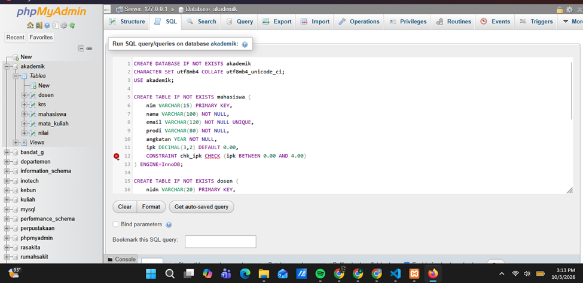
    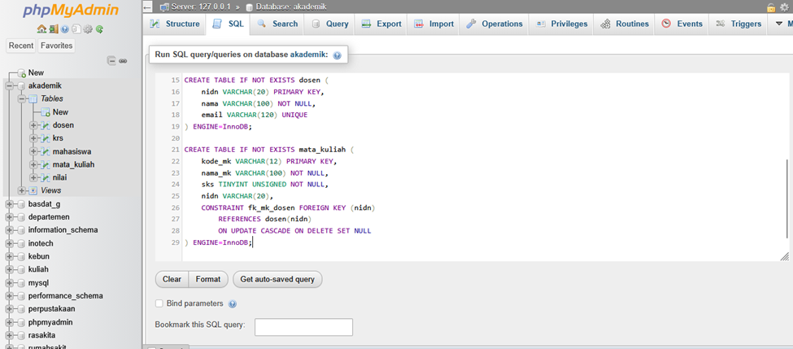
    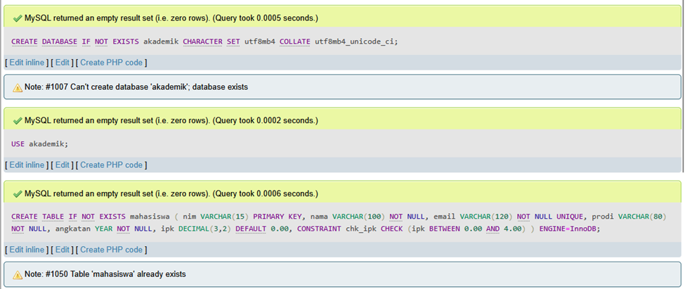
    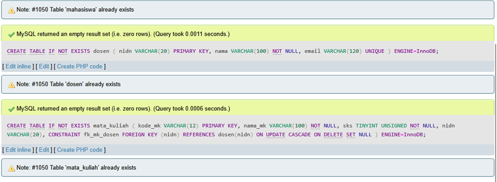
    Sesudah Modifikasi:
    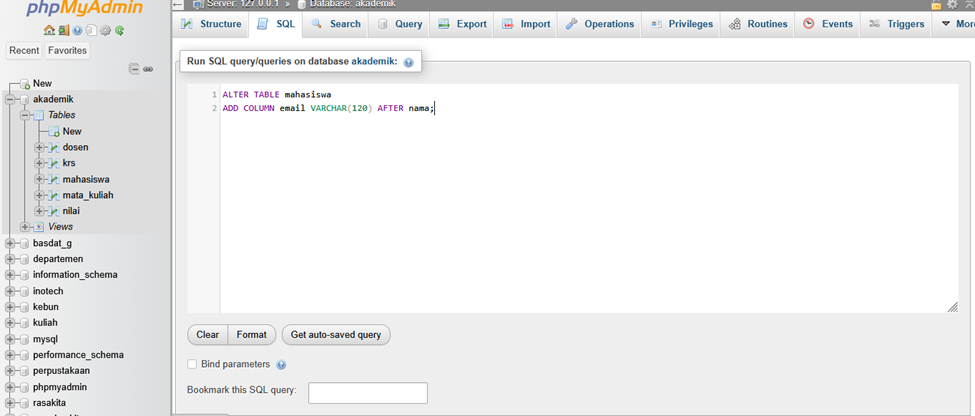
    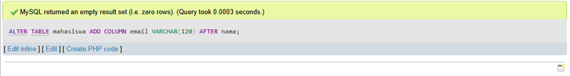
    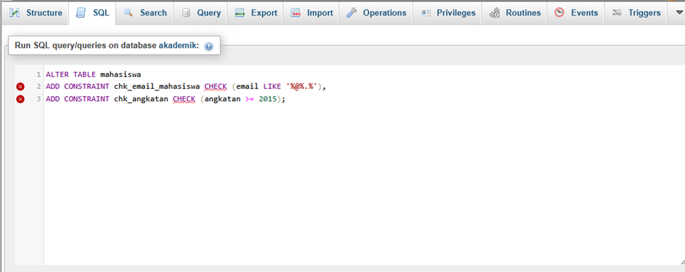
    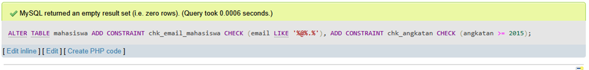
    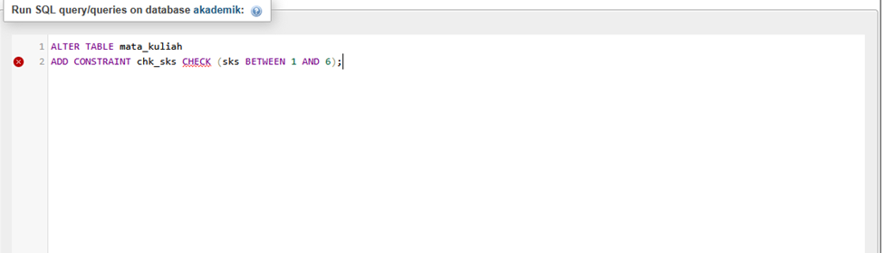
    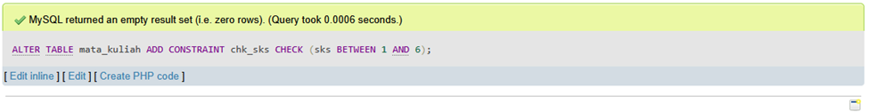
    B. Modifikasi 2: Penambahan Status Persetujuan & Constraint Semester pada krs
    Sebelum Modifikasi:
    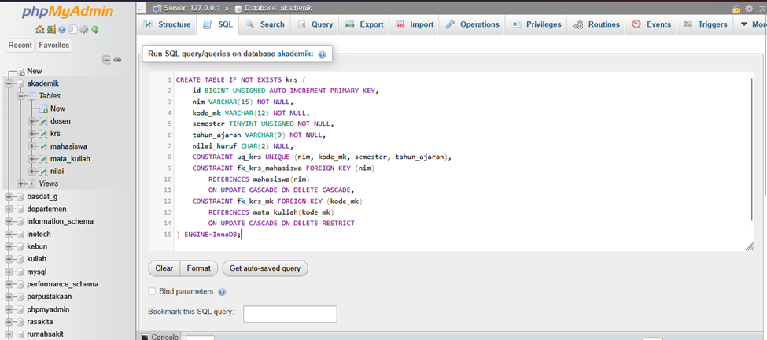
    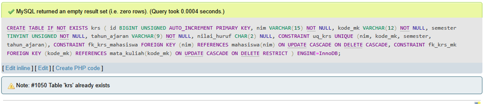
    Sesudah Modifikasi:
    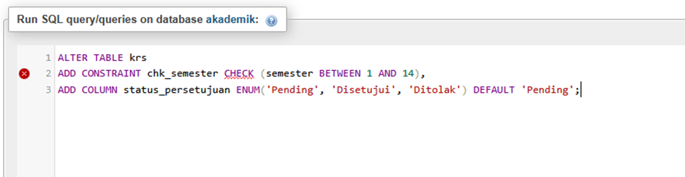
    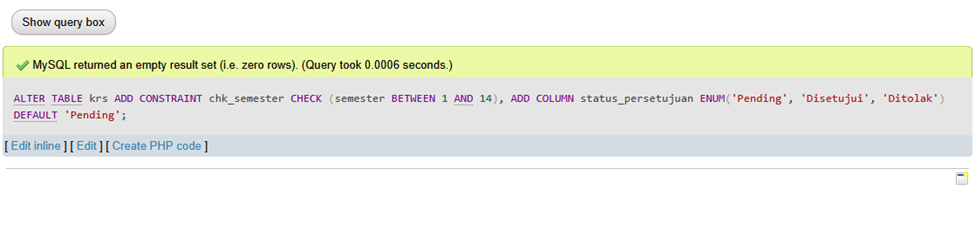

5. Tuliskan satu error yang pernah muncul, penyebabnya, dan langkah perbaikannya.
    Pesan Error yang Muncul:
    #1050 - Table 'krs' already exists
*(Serta kemunculan Static Analysis Error/Linter phpMyAdmin pada klausa `CHECK`)*
    Penyebab:   MySQL menolak pembuatan tabel krs karena tabel dengan nama tersebut sudah pernah dibuat sebelumnya di dalam database akademik.   Adanya bentrok visual parser (Static Analysis/Linter) pada editor phpMyAdmin saat membaca kata kunci CHECK tanpa nama constraint eksplisit.   
    Langkah Perbaikan:
    Jalankan perintah DROP TABLE IF EXISTS krs; terlebih dahulu untuk menghapus struktur tabel lama sebelum mengeksekusi ulang skrip pembuatan tabel[cite: 11].
    Atau gunakan klausa CREATE TABLE IF NOT EXISTS krs agar query pembuatan tabel diabaikan secara aman jika tabel sudah ada di database[cite: 11].
    Untuk penulisan CHECK, tambahkan nama constraint secara eksplisit seperti CONSTRAINT chk_semester CHECK (...) untuk menghindari kesalahan pembacaan parser pada phpMyAdmin[cite: 11].   

